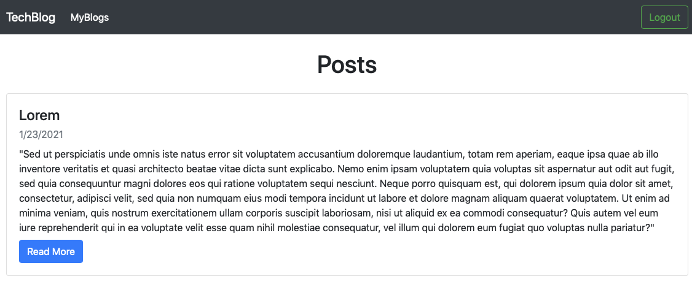
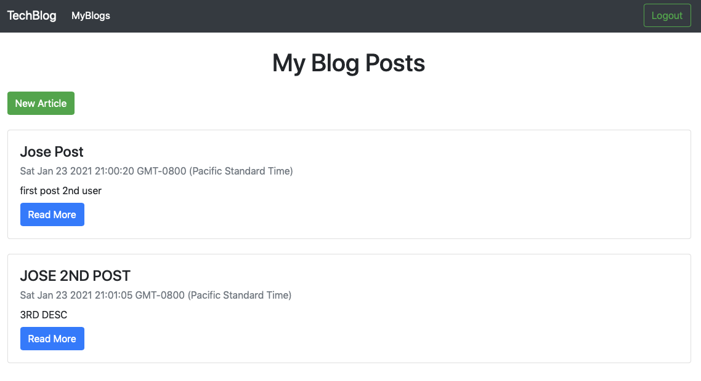

  # TechBlog

  # Table of Contents
  - [Description](#description)
  - [Installation](#installation)
  - [Usage](#usage)
  - [License](#license)
  - [Contributors](#contributors)
  - [Testing](#testing)
  - [Username](#username)
  - [Email](#email)

  ## Description:
    This is a simple webased techblog that allows for the creation of unique user accounts. Each user can create blog posts for display on the home page. Each user can also view all of their posts under the MyBlogs page which is only accessible if logged in.

    ***Please note when creating a new user, user must log out and log back in in order for MyBlogs tab to work. Still working to resolve this bug.

Below is an image of the homepage:

Below is an image of individual posts from logged in user:

  ## Installation:
    npm install bcrypt connect-session-sequelize dotenv express express-handlebars express-session express-session handlebars mysql2 sequelize
  ## Usage:
    This app will primarily be used to create any type of blog.
  ## License:
    MIT
  ## Contributors
    Ivan Flores Silvar
  ## Testing
    use log in ivan@mail.com password: 123456 or login user2@mail.com password: 123456.
  ## Username
    ifsilvar
  ## Email
    fl0resivan@yahoo.com
  ## Questions:
    Got any questions or comments? Visit my GitHub Page
    - [GitHub](https://github.com/ifsilvar)

    For direct contact send me a message at: fl0resivan@yahoo.com.

